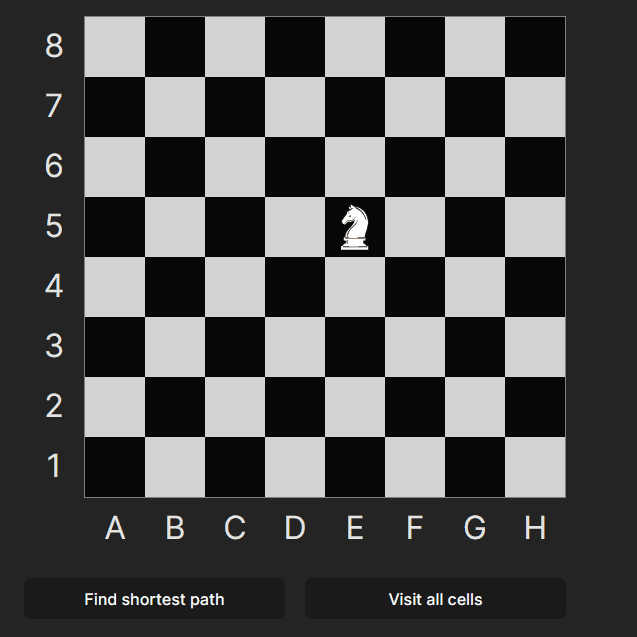
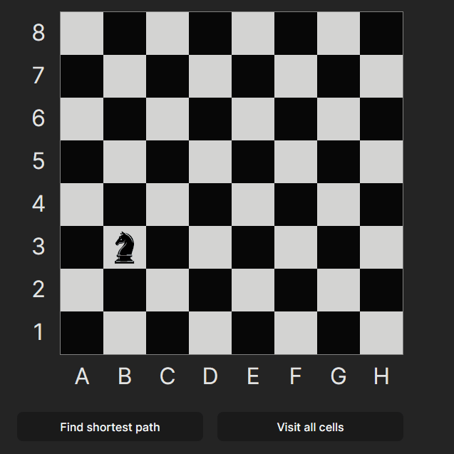

# [Knight Travails](https://mclilzee.github.io/knight-travails-react/)

A lost knight looking for the shortest route to his path.
OR! Perhaps it is a knight full of adventurous qualities trying to explore all the regions!

Place the knight on the chess board by dragging it to the chosen location, then choose a target for the knight to go to.
Alternatively, after placing the knight, command it to explore all the regions without exploring any single region twice!

# Examples

### Moving knight

### Finding path

### Visiting all cells

